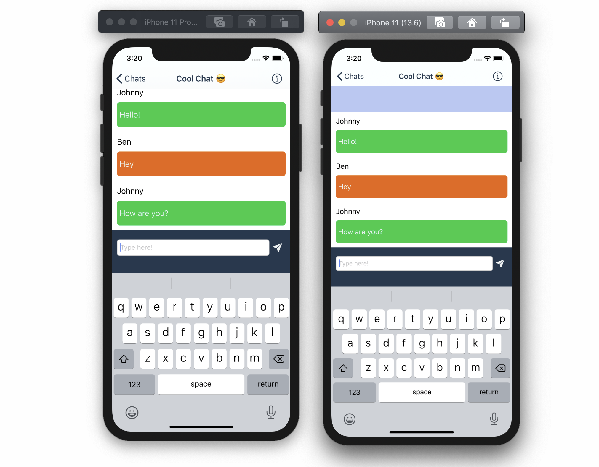

# Swift-iOS-Messaging-App
A messaging app written in Swift using firebase. This was really just a way to play with a range of static and dynamic UITableViews and UITableViewControllers with some custom cells. Took just over a week to make. Still alot of room for improvements and fixes but it works alright i guess. It is beginning to hit the limit of what firebase iOS can do such as not being able to [delete collections](https://firebase.google.com/docs/firestore/manage-data/delete-data#collections). Might continue with this in the future when I have a lil backend system for it, so that can do some of the heavy lifting instead.

  

## Screenshots:

### Login:

  
  

### Chats:

  
  

### Send Messages:

  
  

### Group Chats:

  

## Features:
- Securely register and login with email & password using Firebase
- All data is securely stored in a Firestore.
- Create chats
- Add & remove users from chats
- All menus / data update in realtime so no delay between users.
- Change the bubble colour for each user and the colour for the chat.

## Things I've learnt during this project
- NoSQL Databases - how to structure and organise data.
- Firebase authentication.
- Firebase's NoSQL database Firestore.
- Creating and using custom cells within a table view.

## Packages used
- Firebase / Auth - for authentication
- Firebase / Firestore - for storage of the messages and the data
- IQKeyboardManager - to provide a easy way to have a better keyboard.
- ChameleonFramework - for pretty colours.
